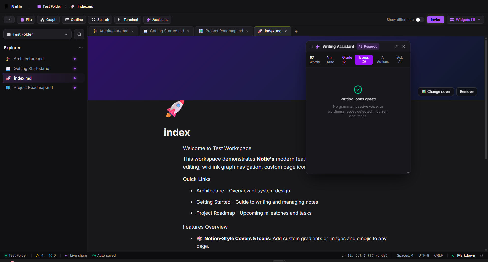

<div align="center">

<picture>
  <source media="(prefers-color-scheme: dark)" srcset="./resources/logo.png">
  
</picture>

# Repaper

<p align="center">
  <strong>The Next-Gen Local-First Hybrid Block-Markdown Knowledge Workspace</strong><br />
  <em>Fast, distraction-free, and private by design. Zero cloud lock-in.</em>
</p>

<p align="center">
  <a href="https://github.com/HawkdotDev/repaper/blob/main/LICENSE"></a>
  <a href="https://nodejs.org"></a>
  <a href="https://react.dev"></a>
  <a href="https://www.typescriptlang.org"></a>
  <a href="https://vite.dev"></a>
  <a href="https://tailwindcss.com"></a>
  <a href="https://bun.sh"></a>
  
</p>

<p align="center">
  <a href="#overview">Overview</a> •
  <a href="#key-features">Key Features</a> •
  <a href="#editor-capabilities">Editor Capabilities</a> •
  <a href="#technology-stack">Tech Stack</a> •
  <a href="#keyboard-shortcuts">Shortcuts</a> •
  <a href="#getting-started">Getting Started</a> •
  <a href="#project-architecture">Architecture</a> •
  <a href="#yaml-frontmatter-spec">Frontmatter</a> •
  <a href="#contributing">Contributing</a>
</p>

<p align="center">
  
</p>

</div>

---

## Overview

**Repaper** is an ultra-fast, local-first web workspace and personal knowledge management (PKM) environment designed for developers, researchers, writers, and technical creators.

Traditional tools force an uncomfortable trade-off: either you choose rich block ergonomics trapped inside proprietary cloud databases (Notion), or you choose plain-text markdown files with primitive editing tools.

**Repaper bridges this gap:**

- **Hybrid Block-Markdown Engine**: Write fluidly with modern block-level interactions (drag-and-drop, slash commands, callouts, tables, code blocks) while your notes are saved as pure, standard, portable `.md` files.
- **True Local-First Privacy**: Your data belongs to you. Repaper executes entirely in your browser with zero analytics, zero external tracking, and zero cloud lock-in.
- **Dual-Storage Architecture**: Open and edit real directories on your device using the modern **File System Access API**, or utilize the persistent **IndexedDB Virtual File System** across any browser or mobile device.

---

## Key Features

### 🧱 1. Hybrid Block-Markdown Architecture

- **Bi-Directional Serialization**: Seamlessly transitions between raw CommonMark/GFM markdown and interactive block trees.
- **Rich Media & Embeds**: Embed YouTube, Vimeo, audio clips, interactive frames, and custom images with inline captioning and sizing.
- **STEM & Diagramming First-Class**:
  - **KaTeX Mathematics**: Native inline equations (`$E=mc^2$`) and display formulas (`$$\sum_{i=1}^{n} x_i$$`).
  - **Mermaid.js Diagrams**: Render live flowcharts, sequence diagrams, state machines, and entity-relationship diagrams directly inside your documents.
- **Drag-and-Drop Organization**: Reorder paragraphs, lists, headers, and callouts with intuitive drag handles.

### 🔗 2. Interlinked Knowledge & Bidirectional Graph

- **Wikilinks Syntax**: Link thoughts organically using `[[Note Title]]` with instant fuzzy search suggestions.
- **Automatic Backlinks & Forward Links**: Track every inbound and outbound reference across your entire repository.
- **Hardware-Accelerated Canvas Graph**: Visualize your interconnected digital brain in a dynamic force-directed canvas graph that highlights connection clusters, hub notes, and orphan pages.

### 🎨 3. Deep Page & Typography Customization

- **Granular Typography Controls**: Adjust font family (Inter, Roboto, JetBrains Mono, Outfit, Serif, Dyslexic-friendly), font size, line height, letter spacing, font weight, and text alignment per-document or globally.
- **Visual Covers & Emojis**: Enrich pages with Unsplash imagery, vibrant gradient headers, and custom emoji avatars.
- **Zero-Pollution Frontmatter**: All visual customizations and metadata are stored cleanly in standard YAML frontmatter blocks at the top of your markdown files.

### 🎙️ 4. Voice Dictation & Speech Commands

- **Hands-Free Note Taking**: Built-in speech-to-text dictation with automatic smart punctuation and capitalization (`Alt + D` / `Alt + V`).
- **Interactive Voice Cheat Sheet**: Modal reference for hands-free workflow commands and productivity triggers.

### ⚡ 5. Power-User Navigation & Ergonomics

- **Quick Switcher (`Ctrl/Cmd + P`)**: Instantaneous fuzzy search across all files and folders in your workspace.
- **Document Outline / TOC**: Live hierarchical table of contents panel for jumping between headings in long-form documents.
- **Find in Document (`Ctrl/Cmd + F`)**: Fast in-editor text searching.
- **Distraction-Free Immersion (`F11`)**: Fullscreen view hiding extraneous UI chrome for pure focus.
- **Real-Time Document Telemetry**: Status bar displaying live word count, character count, estimated reading time, active cursor position, and autosave state.

### 💾 6. Universal Data Portability & Sharing

- **Single-File & Workspace ZIP Export**: Export individual documents as clean Markdown (`.md`), HTML, or structured JSON, or download your entire workspace as a compressed `.zip` archive at any moment.
- **Local Folder Access**: Connect directly to your local Obsidian vault or Git repository without cloud syncing intermediaries.

---

## Editor Capabilities

Repaper supports a comprehensive suite of structured content blocks and inline formatting:

| Block Type                     | Markdown Equivalent / Trigger | Capabilities                                                        |
| :----------------------------- | :---------------------------- | :------------------------------------------------------------------ |
| **Heading**                    | `# H1` to `###### H6`         | Hierarchy levels 1–6, anchor generation, outline sync               |
| **Paragraph**                  | Plain text                    | Fluid typing, inline formatting, wikilink support                   |
| **Checklist**                  | `- [ ]` / `- [x]`             | Interactive toggling, task tracking, progress calculation           |
| **List (Bulleted & Numbered)** | `- item` / `1. item`          | Ordered and unordered nested lists with keyboard navigation         |
| **Code Fence**                 | ` ```language `               | Monospace formatting, syntax highlighting, copy-to-clipboard        |
| **Math Block**                 | `$$ formula $$` or `$math$`   | Hardware-rendered KaTeX LaTeX mathematical expressions              |
| **Mermaid Diagram**            | ` ```mermaid `                | Live flowcharts, sequence diagrams, class models, mind maps         |
| **Table**                      | `\| col \| col \|`            | Editable rows/columns, table headers, column operations             |
| **Blockquote**                 | `> quote`                     | Stylized accent quotes with attribution support                     |
| **Delimiter**                  | `---` / `***`                 | Horizontal page dividers and visual breaklines                      |
| **Image**                      | ``                 | File upload, URL embeds, custom captions, alignment                 |
| **Video & Embeds**             | URLs / Embed codes            | YouTube, Vimeo, custom video player, responsive iframe embedding    |
| **Wikilinks**                  | `[[Note Name]]`               | Bi-directional note linking, fuzzy auto-complete, click-to-navigate |

---

## Technology Stack

| Layer                | Technology                                                                                                                                                               | Details                                                                     |
| :------------------- | :----------------------------------------------------------------------------------------------------------------------------------------------------------------------- | :-------------------------------------------------------------------------- |
| **Core Framework**   | [React 19](https://react.dev/)                                                                                                                                           | Concurrent rendering, modern hooks, zero class boilerplate                  |
| **Language**         | [TypeScript 5.9](https://www.typescriptlang.org/)                                                                                                                        | Strict type checking across the entire codebase                             |
| **Build & Tooling**  | [Vite 7](https://vite.dev/) + [Bun](https://bun.sh/)                                                                                                                     | Instant HMR dev server, optimized rollup bundling, fast test runner         |
| **Styling & Theme**  | [Tailwind CSS 4](https://tailwindcss.com/) + CSS Tokens                                                                                                                  | Modern CSS variables, glassmorphic brutalist aesthetic, multi-theme engine  |
| **Editor Core**      | [Editor.js 2.30](https://editorjs.io/)                                                                                                                                   | Block-based modular editing framework with custom tools                     |
| **STEM Rendering**   | [KaTeX](https://katex.org/) + [Mermaid.js](https://mermaid.js.org/)                                                                                                      | Lightning-fast LaTeX math rendering and SVG diagram generation              |
| **Storage Engine**   | [IndexedDB](https://developer.mozilla.org/en-US/docs/Web/API/IndexedDB_API) + [File System Access API](https://developer.mozilla.org/en-US/docs/Web/API/File_System_API) | High-performance client-side storage + direct local folder binding          |
| **Sanitization**     | [DOMPurify 3.4](https://github.com/cure53/DOMPurify)                                                                                                                     | Complete XSS defense for parsed HTML and rendered embeds                    |
| **Iconography**      | [Lucide React](https://lucide.dev/)                                                                                                                                      | Clean, accessible SVG icons                                                 |
| **Background Tasks** | [Web Workers](https://developer.mozilla.org/en-US/docs/Web/API/Web_Workers_API)                                                                                          | Asynchronous tokenization, full-text search indexing, and graph computation |

---

## Keyboard Shortcuts

Designed for keyboard-first efficiency. All shortcuts automatically adapt between macOS (`Cmd`) and Windows/Linux (`Ctrl`):

| Shortcut (Win / Linux)                                         | Shortcut (macOS)                                                     | Action                                        |
| :------------------------------------------------------------- | :------------------------------------------------------------------- | :-------------------------------------------- |
| <kbd>Ctrl</kbd> + <kbd>S</kbd>                                 | <kbd>Cmd</kbd> + <kbd>S</kbd>                                        | **Save Active Document** manually             |
| <kbd>Ctrl</kbd> + <kbd>O</kbd>                                 | <kbd>Cmd</kbd> + <kbd>O</kbd>                                        | **Open Workspace** folder from disk           |
| <kbd>Ctrl</kbd> + <kbd>N</kbd>                                 | <kbd>Cmd</kbd> + <kbd>N</kbd>                                        | **Create New Document** at workspace root     |
| <kbd>Ctrl</kbd> + <kbd>W</kbd>                                 | <kbd>Cmd</kbd> + <kbd>W</kbd>                                        | **Close Active Document Tab**                 |
| <kbd>Ctrl</kbd> + <kbd>P</kbd>                                 | <kbd>Cmd</kbd> + <kbd>P</kbd>                                        | **Toggle Quick Switcher** (Fuzzy file search) |
| <kbd>Ctrl</kbd> + <kbd>F</kbd>                                 | <kbd>Cmd</kbd> + <kbd>F</kbd>                                        | **Find in Document**                          |
| <kbd>Ctrl</kbd> + <kbd>,</kbd>                                 | <kbd>Cmd</kbd> + <kbd>,</kbd>                                        | **Open Settings Modal**                       |
| <kbd>Ctrl</kbd> + <kbd>Shift</kbd> + <kbd>L</kbd>              | <kbd>Cmd</kbd> + <kbd>Shift</kbd> + <kbd>L</kbd>                     | **Toggle Theme** (Dark / Light)               |
| <kbd>Alt</kbd> + <kbd>D</kbd> or <kbd>Alt</kbd> + <kbd>V</kbd> | <kbd>Option</kbd> + <kbd>D</kbd> or <kbd>Option</kbd> + <kbd>V</kbd> | **Toggle Voice Dictation**                    |
| <kbd>Ctrl</kbd> + <kbd>Shift</kbd> + <kbd>D</kbd>              | <kbd>Cmd</kbd> + <kbd>Shift</kbd> + <kbd>D</kbd>                     | **Toggle Voice Dictation** (Alternative)      |
| <kbd>F11</kbd>                                                 | <kbd>F11</kbd>                                                       | **Toggle Fullscreen Mode**                    |
| <kbd>Esc</kbd>                                                 | <kbd>Esc</kbd>                                                       | **Exit Fullscreen / Close Active Modal**      |

---

## Getting Started

### Prerequisites

- **Node.js** `>= 20.0.0` or **Bun** `>= 1.0.0`
- A modern evergreen browser (Chrome, Edge, Brave, Firefox, or Safari). _Note: Chrome/Edge/Brave support the native File System Access API for opening local folders directly._

### Quick Start

```bash
# 1. Clone the repository
git clone https://github.com/HawkdotDev/repaper.git
cd repaper

# 2. Install dependencies (using npm or bun)
npm install
# or
bun install

# 3. Start the local development server
npm run dev
# or
bun run dev
```

Visit `http://localhost:5173` in your browser. The application will start immediately with hot module replacement (HMR).

### Building for Production

```bash
# Build production bundle
npm run build

# Preview the production build locally
npm run preview
```

Static web assets are compiled into the `dist/` folder. Because Repaper is fully client-side, you can deploy the `dist/` directory to any static web hosting platform:

- **Cloudflare Pages**
- **Vercel**
- **Netlify**
- **GitHub Pages**
- **Docker / Nginx**

### Development Scripts & Testing

```bash
# Run unit tests
bun test

# Type-check TypeScript without emitting JS
npm run typecheck

# Run ESLint validation
npm run lint

# Format codebase with Prettier
npm run format
```

---

## YAML Frontmatter Spec

Repaper maintains 100% standard Markdown fidelity. Document-specific styling, banners, icons, and visual preferences are persisted using standard YAML frontmatter at the top of the file:

```markdown
---
title: 'Quarterly Strategy & System Design'
icon: '🚀'
cover: 'https://images.unsplash.com/photo-1506744038136-46273834b3fb'
fontFamily: 'JetBrains Mono'
fontSize: 16
lineHeight: 1.75
letterSpacing: 0.5
fontWeight: 400
textAlign: 'left'
showTitle: true
showCover: true
showIcon: true
tags:
  - architecture
  - engineering
  - roadmap
---

# Quarterly Strategy & System Design

Write your document content here using standard CommonMark or Editor blocks...
```

If you open these files in Obsidian, VS Code, Logseq, or GitHub, the frontmatter is recognized as standard metadata, ensuring your notes remain readable across any software.

---

## Contributing

Contributions, bug reports, and ideas are welcome!

1. Fork the repository on GitHub.
2. Create a feature branch (`git checkout -b feature/my-new-feature`).
3. Commit your changes (`git commit -m 'feat: add my new feature'`).
4. Ensure all tests and typechecks pass (`bun test && npm run typecheck`).
5. Push to your fork (`git push origin feature/my-new-feature`).
6. Open a Pull Request with a clear explanation of your improvements.

---

## License

Distributed under the **MIT License**. See [`LICENSE`](LICENSE) for full details.

<div align="center">
  <br />
  <sub>Designed and engineered with care by the <strong>Repaper</strong> Open Source Community.</sub>
</div>
