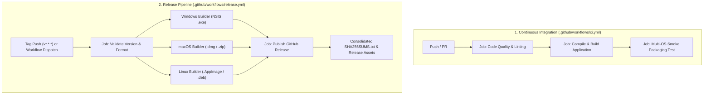

# CI/CD & Release Pipeline Guide

This guide details the continuous integration (CI) and release automation pipelines built for **Repaper** using GitHub Actions.

---

## 🏗 Pipeline Architecture Overview

The repository features two primary GitHub Actions workflows:



---

## 1. Continuous Integration (`ci.yml`)

### When It Runs

- **On Push** to branches: `main`, `master`, `develop`, and `release/**`
- **On Pull Requests** targeting: `main`, `master`, `develop`
- **Manual Trigger** via GitHub Actions tab (`workflow_dispatch`)

### Jobs & Verification Steps

1. **`code-quality`**:
   - `npm run format:check`: Validates Prettier code style.
   - `npm run lint`: Executes ESLint 9 checks.
   - `npm run typecheck`: Runs dual-target TypeScript validation for Node (Main/Preload) and Web (Renderer).
2. **`build`**:
   - `npm run build`: Executes `electron-vite build` and verifies all bundle outputs (`out/main`, `out/preload`, `out/renderer`).
3. **`smoke-packaging` (Matrix: Windows, macOS, Linux)**:
   - Runs `npm run build:unpack` on each OS runner to guarantee native Electron packaging builds cleanly across all supported platforms.

---

## 2. Release Pipeline (`release.yml`)

### When It Runs

- **On Tag Push**: Any git tag matching `v*.*.*` (e.g. `v0.2.1`, `v1.0.0`, `v1.0.0-beta.1`)
- **Manual Trigger**: Via GitHub Actions `workflow_dispatch` with options:
  - `tag_name`: Specify custom release tag (e.g. `v0.2.2`).
  - `is_draft`: Mark release as a Draft (default `false`).
  - `is_prerelease`: Mark release as a Pre-release (default `false`).

### Output Artifacts by Platform

| Platform     | Runner           | Formats Generated                                         |
| :----------- | :--------------- | :-------------------------------------------------------- |
| **Windows**  | `windows-latest` | `Repaper-<version>-setup.exe`, `.exe.blockmap`, `.sha256` |
| **macOS**    | `macos-latest`   | `Repaper-<version>-universal.dmg`, `.zip`, `.sha256`      |
| **Linux**    | `ubuntu-latest`  | `Repaper-<version>-x64.AppImage`, `.deb`, `.sha256`       |
| **Manifest** | `ubuntu-latest`  | Consolidated `SHA256SUMS.txt`                             |

---

## 🚀 Step-by-Step: How to Publish a Release

### Method 1: Semantic Git Tagging (Recommended)

1. **Update version in `package.json`**:
   ```bash
   npm version 0.3.0 --no-git-tag-version
   ```
2. **Commit and push changes**:
   ```bash
   git add package.json package-lock.json
   git commit -m "chore(release): bump version to 0.3.0"
   git push origin main
   ```
3. **Create and push the release tag**:
   ```bash
   git tag v0.3.0
   git push origin v0.3.0
   ```
4. GitHub Actions will automatically launch the **Release** workflow, compile all binaries for Windows, macOS, and Linux, generate checksums, and publish the GitHub Release.

---

### Method 2: GitHub Web UI (Manual Dispatch)

1. Navigate to **Actions** in your GitHub repository.
2. Select **Release** from the left sidebar.
3. Click **Run workflow**.
4. (Optional) Provide a custom tag name and toggle Draft / Pre-release status.
5. Click **Run workflow**.

---

## 🔐 Optional: Code Signing & Notarization Configuration

To enable cryptographic code signing and Apple notarization, add the following secrets in your repository settings under **Settings > Secrets and variables > Actions**:

### macOS (Apple Developer Program)

| Secret Name                   | Description                                                |
| :---------------------------- | :--------------------------------------------------------- |
| `CSC_LINK`                    | Base64-encoded Apple Developer certificate (`.p12`) or URL |
| `CSC_KEY_PASSWORD`            | Password for your `.p12` certificate                       |
| `APPLE_ID`                    | Your Apple ID email                                        |
| `APPLE_APP_SPECIFIC_PASSWORD` | App-specific password generated from appleid.apple.com     |
| `APPLE_TEAM_ID`               | 10-character Apple Developer Team ID                       |

### Windows (Code Signing Certificate)

| Secret Name            | Description                                           |
| :--------------------- | :---------------------------------------------------- |
| `WIN_CSC_LINK`         | Base64-encoded `.pfx` code signing certificate or URL |
| `WIN_CSC_KEY_PASSWORD` | Password for your `.pfx` certificate                  |

> [!NOTE]
> If these secrets are not configured, `electron-builder` will build unsigned binaries without failing.

---

## 🧪 Local Testing Commands

Before pushing or creating a PR, you can run the exact verification suite locally:

```bash
# 1. Typecheck
npm run typecheck

# 2. Lint
npm run lint

# 3. Format check
npm run format:check

# 4. Compile build
npm run build

# 5. Fast packaging smoke test (directory mode)
npm run build:unpack
```
